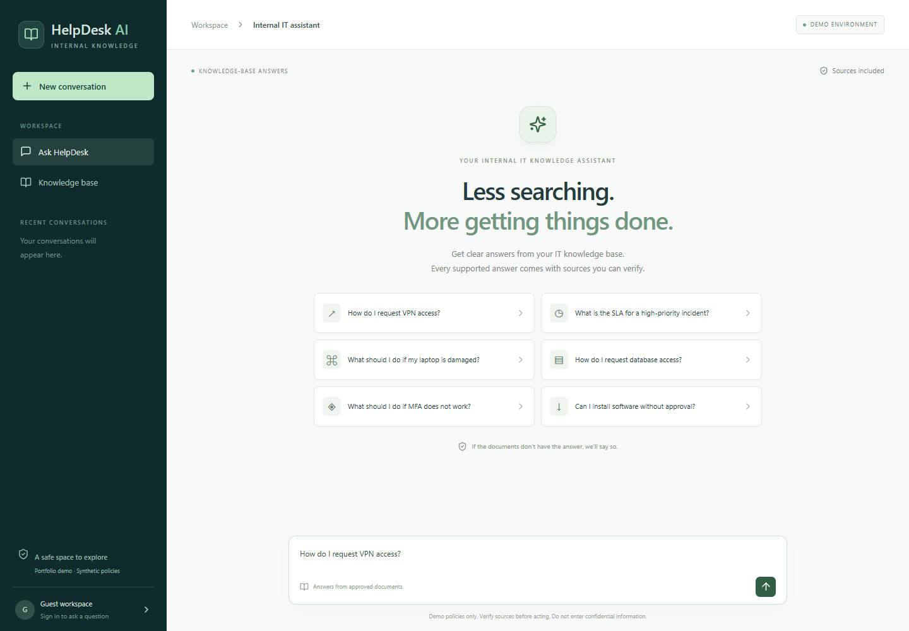
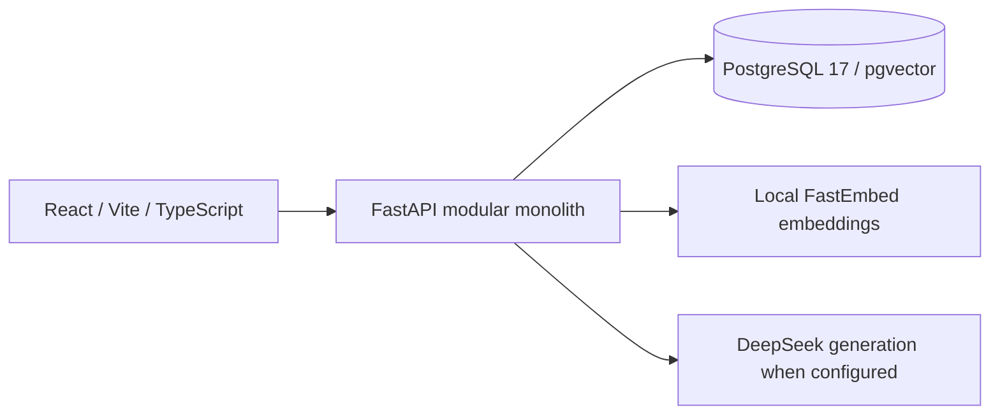
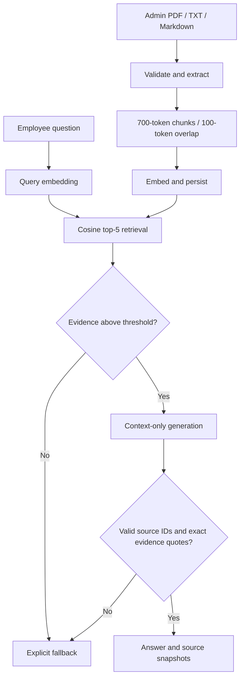

# HelpDesk AI

**Internal IT Knowledge Assistant · Portfolio Project 4**

A grounding-first knowledge assistant for synthetic internal IT policies. React provides a source-aware chat workspace; FastAPI retrieves PostgreSQL/pgvector chunks. Local FastEmbed creates embeddings; DeepSeek is configured for evidence-backed generation when an API key is available. Unsupported questions are designed to return an explicit fallback.

**Status: implementation in progress, not publicly deployed or end-to-end verified.** Live demo and API URLs are not available yet. This repository does not claim measured accuracy or business savings.

## Why this project

Employees often search scattered documentation or ask IT the same questions. HelpDesk AI demonstrates a different workflow: ask → retrieve approved documentation → answer with inspectable evidence → verify the source. It complements screening, BI, and process automation portfolio projects with practical knowledge retrieval and AI traceability.

## Features implemented

- React chat workspace with examples, conversation history, source panel, and feedback.
- PDF/TXT/Markdown extraction, validation, token chunking, and embedding adapter.
- PostgreSQL 17 + pgvector schema, Alembic migration, cosine retrieval, and audit snapshots.
- DeepSeek generation adapter with context-only prompting, source ID validation, and exact-quote validation; OpenRouter remains an optional adapter. Live generation has not yet been tested.
- Document library, administrator upload/removal/reindexing, and persisted usage analytics.
- JWT authentication, Argon2 password hashes, role/ownership checks, exact CORS origins, provider timeouts, and basic process-local request limits.
- Eight clearly labeled synthetic policies, a 14-question measured retrieval set, and a separate full RAG evaluation runner awaiting a generation key.

Implementation does not mean every feature has passed integration testing. See [verification status](docs/verification.md).

## Architecture and RAG

Default embedding model is `BAAI/bge-small-en-v1.5` (384 dimensions), tested locally with real vectors. Default generation model is `deepseek-flash`; no authenticated request has been made yet. Models are environment-configurable. Changing the embedding model requires reindexing; the database column can store different dimensions, but vectors of different sizes cannot be compared. The current 0.70 similarity threshold was tuned on this small synthetic set and is not calibrated confidence.

## Local setup

Prerequisites: Python 3.12, Node 22+, and Docker with a working Linux engine. A DeepSeek API key is required to test generated answers; document ingestion and retrieval work locally without one.

1. Copy `.env.example` to `.env`. Set a random database password, matching `DATABASE_URL`, and a random JWT secret of at least 32 characters. Set `DEEPSEEK_API_KEY` only when available. Never commit this file. Use URL-safe database credentials or URL-encode the password in database URLs.
2. Run `docker compose up -d db`. The database uses host port 55432 by default to avoid conflicts with other local projects. Then run `docker compose up --build api`. The API applies Alembic migrations at startup and listens at `http://localhost:8000`.
3. Create accounts explicitly: `docker compose exec api python -m app.manage create-user --email admin@example.test --role admin`, then repeat with `--role employee` for the demo user. Passwords are prompted privately; minimum 12 characters.
4. In `frontend`, run `npm ci` and `npm run dev`. The default API URL is `http://localhost:8000`. Set `VITE_API_URL` in `frontend/.env` if different.
5. Sign in as administrator and upload the Markdown files in `sample-data`. Alternatively install the backend requirements locally and run `python backend/seed.py` from the root with the API running.
6. Ask an example question, inspect citations, reload history, submit feedback, and check analytics.

For backend development without a container: create a virtual environment, install `backend/requirements.txt`, set environment variables (or copy the local `.env` into `backend/.env`), then from `backend` run `alembic upgrade head` and `uvicorn app.main:app --reload`.

## Testing

From `backend`: `python -m pytest -q`. Set `TEST_DATABASE_URL` to an isolated PostgreSQL database with extension permissions to enable the vector persistence test. It creates a transaction-scoped test schema and rolls it back; it does not drop the public schema.

From `frontend`: `npm run build`, `npm run lint`, and `npm test`. With local API and frontend running plus ignored `.demo-credentials.json`, run `npm run test:e2e` for Edge browser regression.

The measured retrieval-only results are in [evaluation-retrieval.json](docs/evaluation-retrieval.json). Full RAG evaluation requires a DeepSeek key; `backend/evaluate.py` must not be represented as a completed run until real generation and manual answer review are done. Test fixtures that replace provider responses are unit tests, not AI quality evaluation.

## Data model

`users` → `conversations` → `messages` → `message_sources`; `documents` → `document_chunks`; `feedback` links users and assistant messages. Historical source snapshots preserve evidence after document deletion. Models and prompt versions are stored for assistant messages. Every retrieved match is audited; only sources actually cited are exposed as answer citations.

## Public demo safety and limitations

Portfolio demonstration only. Synthetic documents only. Do not upload confidential information. No enterprise security guarantee, compliance certification, production SLA, or real IT support service.

- Exact quotes and valid citations do not prove semantic entailment. The model can still misunderstand a source.
- No OCR, enterprise IAM, background ingestion queue, or automated policy approval workflow.
- Administrators are responsible for approved content. Uploading makes a document available immediately.
- Ingestion is synchronous and bounded. Rate limits are process-local; deploy one worker until shared limits exist.
- JWT sessions last eight hours and are stored in session storage. No refresh/revocation or account recovery flow.
- Follow-up questions should stand alone; previous chat content is not used as policy evidence.
- Uploads are normalized into indexed text; the original binary is not archived. Source views display the indexed text.
- Reindex recomputes embeddings for current chunks; it does not reparse the original document.
- Public demo users sharing one employee account also share that account's conversation history. Never use personal or confidential data.
- Live generation evaluation and hosted end-to-end testing remain release gates. The current threshold has only been checked on the small synthetic set.

## Deployment and portfolio

See [deployment runbook](docs/deployment.md), [business and system design](docs/design.md), [case study and interview notes](docs/case-study.md), and [verification status](docs/verification.md). The existing portfolio repository is not modified.
