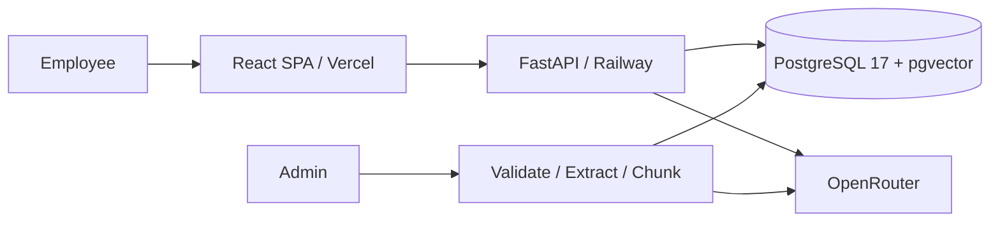

# HelpDesk AI — Internal IT Knowledge Assistant

Portfolio Project 4. Status: design approved by project brief; implementation in progress. All policies and usage in the demonstration are synthetic.

## Business problem and objectives

Employees search scattered IT instructions, ask support repeated questions, and risk following outdated procedures. HelpDesk AI makes approved knowledge searchable through questions, with evidence employees can inspect. The objective is demonstrable retrieval and traceability; no time savings or ROI is claimed without measurement.

## Stakeholders and workflows

Employees ask questions and verify sources. IT administrators maintain approved documents and inspect feedback. Policy owners are responsible for correctness. Recruiters evaluate engineering decisions and reproducible results.

AS-IS: employee searches documents → cannot find procedure → contacts IT → waits → receives manual answer or link. Pain points are discoverability, repeated work, inconsistent advice, and outdated links.

TO-BE: employee asks → system retrieves approved chunks → generates supported answer → exposes citations → employee verifies. Insufficient evidence produces an explicit fallback and direction to IT support.

## Requirements and user stories

| ID | Requirement | Acceptance |
|---|---|---|
| FR-01 | Ask knowledge-base questions | Employee receives an answer or explicit fallback |
| FR-02 | Retrieve document chunks | Persist actual chunk IDs and cosine scores |
| FR-03 | Ground generation | Context-only prompt; reject invalid citation references |
| FR-04 | Inspect sources | Citation opens title, section/page, and excerpt |
| FR-05 | Abstain | Weak retrieval and unsupported generation return fallback |
| FR-06 | Manage documents | Admin uploads PDF/TXT/Markdown, reindexes, removes |
| FR-07 | Conversation history | History persists and is isolated by user |
| FR-08 | Feedback | One editable rating per user and assistant message |
| FR-09 | Analytics | Counts and source usage come from persisted events |

As an employee, I can verify a policy before acting, revisit my conversations, and flag unhelpful answers. As an administrator, I can curate knowledge and identify unanswered questions without viewing fabricated impact metrics.

Non-functional requirements: environment-only secrets; hashed passwords; backend role and ownership checks; upload size/type/text validation; exact CORS origins; safe errors; responsive keyboard-accessible UI; traceable retrieval; bounded provider timeouts and request sizes. Public demo explicitly excludes confidential documents and production support guarantees.

## Architecture

React + TypeScript + Vite + Tailwind + React Router → FastAPI modular monolith → SQLAlchemy → PostgreSQL 17 + pgvector. Alembic owns schema changes. OpenRouter provides embeddings and answer generation. Docker Compose supports local operation; Vercel hosts frontend, Railway hosts API and pgvector PostgreSQL.

## Data model

Users own conversations; conversations own messages. Documents own versioned chunks. Message sources record chunk identity, immutable evidence snapshots, and actual retrieval scores. Feedback references its author and assistant message with a uniqueness constraint. Documents record filename, title, MIME type, timestamps, indexing status, embedding model and content hash. Chunks record page, section, ordinal, text, embedding, and version. Deleting a document excludes it from future retrieval while historical evidence remains identifiable as a snapshot.

## Retrieval and generation design

1. Validate upload (maximum 10 MB); reject unsupported, encrypted/unreadable, empty, or image-only documents. No OCR.
2. Extract PDF page text or UTF-8 TXT/Markdown; normalize whitespace while retaining sections/pages.
3. Split within pages/sections using configurable 700-token windows and 100-token overlap. This balances context with focused citations; short sections remain short.
4. Embed with configurable `openai/text-embedding-3-small` (1536 dimensions). Store model identity; do not mix incompatible embedding spaces.
5. Embed question with the same model; cosine search approved active chunks; retrieve top 5. Start with exact search for the small demo corpus.
6. Use configurable minimum cosine similarity 0.35 as an initial uncalibrated gate. Only qualifying chunks enter the prompt. Evaluate and tune using the synthetic evaluation set before making quality claims.
7. Generate through configurable `google/gemini-2.5-flash-lite`. Treat documents as untrusted data, not instructions; require structured claims and source identifiers.
8. Validate cited identifiers and quoted evidence against supplied chunks. Invalid or absent support causes fallback. Citation validity alone cannot prove semantic entailment; human evaluation remains necessary.
9. Persist retrieval audit, displayed sources, outcome, model, and prompt version with the response.

Similarity is not confidence or semantic certainty. UI displays evidence availability and retrieval scores, never invented confidence percentages. Follow-up questions must remain independently understandable in the initial MVP; conversation history is not an alternative policy source.

## Provider compatibility and deployment decisions

Official OpenRouter documentation confirms `POST https://openrouter.ai/api/v1/embeddings` and lists `openai/text-embedding-3-small`; generation uses `/chat/completions`. Live authenticated compatibility must still be tested before deployment. Models are configurable because availability can change.

- https://openrouter.ai/docs/api/api-reference/embeddings/create-embeddings
- https://openrouter.ai/docs/api/api-reference/embeddings/list-embeddings-models
- https://openrouter.ai/google/gemini-2.5-flash-lite/performance
- https://docs.railway.com/guides/embeddings-pipeline

Use a Railway pgvector-enabled image with a persistent volume and verify `CREATE EXTENSION vector` before migrations. Do not assume the default PostgreSQL image contains pgvector. No database-provider switch is currently needed.

## Quality and release gates

Pytest covers extraction, chunking, validation, provider failures, citation rejection, fallback, persistence, ownership, and feedback. PostgreSQL integration tests verify migrations, vector persistence, and retrieval. Frontend gates are build, lint, critical behavior tests, and browser verification. Synthetic evaluation reports only computed retrieval Hit@K, fallback outcomes, and checked citation validity; semantic answer support requires documented review.

Release requires real embeddings, seeded documents, public API and frontend integration, CORS verification, source inspection, negative queries, admin authorization, and clean secret-free Git status. Until these pass, no live-completion claim is permitted.

## Limitations and security

Small synthetic corpus, no OCR, no enterprise IAM, no production SLA, no compliance certification. Prompt injection and semantic hallucination cannot be eliminated by prompts or citation checks. Admin-only ingestion limits exposure. Public usage needs bounded request rates and a provider spending limit. The demonstration is not a production IT support service.
